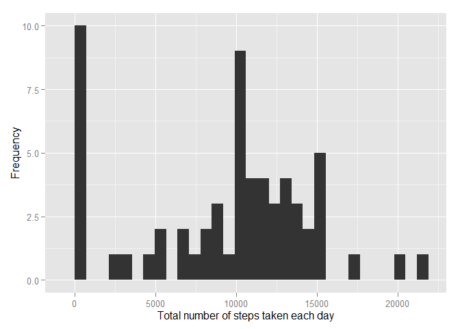
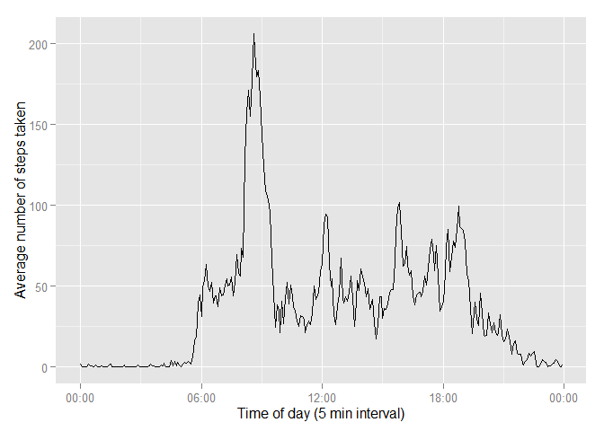
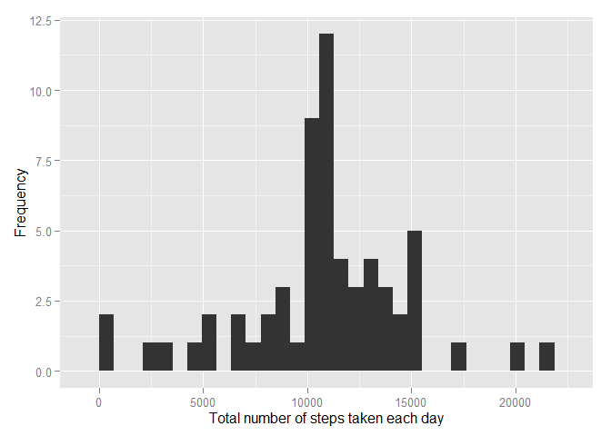
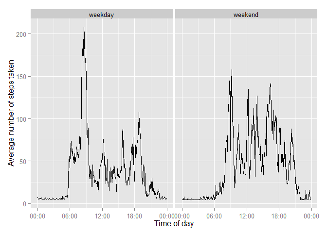

# Reproducible Research: Peer Assessment 1


```r
library(knitr)
opts_chunk$set(echo=TRUE)
```

##Loading and preprocessing the data

Read the data.


```r
activity <- read.csv('activity.csv')
```

Create a date.time column that contains the date and interval values.


```r
time <- formatC(activity$interval / 100, 2, format='f')
activity$date.time <- as.POSIXct(paste(activity$date, time),
                                 format='%Y-%m-%d %H.%M',
                                 tz='GMT')
```

For analyzing the means at the different times of day, we will only focus on the time column.


```r
activity$time <- format(activity$date.time, format='%H:%M:%S')
activity$time <- as.POSIXct(activity$time, format='%H:%M:%S')
```

##What is mean total number of steps taken per day?

Firstly, calculate the total number of steps per day:


```r
total.steps <- tapply(activity$steps, activity$date, sum, na.rm=TRUE)
```

The mean and median values for the total steps per day:


```r
mean(total.steps)
```

```
## [1] 9354.23
```

```r
median(total.steps)
```

```
## [1] 10395
```

Creating a histogram to look at the distribution of total number of steps per day:


```r
library(ggplot2)
qplot(total.steps, xlab='Total number of steps taken each day', ylab='Frequency')
```

```
## stat_bin: binwidth defaulted to range/30. Use 'binwidth = x' to adjust this.
```

 

##What is the average daily activity pattern?

Calculating the mean steps for each 5-minute interval:


```r
mean.steps <- tapply(activity$steps, activity$time, mean, na.rm=TRUE)
daily.pattern <- data.frame(time=as.POSIXct(names(mean.steps)),
                            mean.steps=mean.steps)
```

Creating a time series plot for the mean steps for each 5-minute interval during the day:


```r
library(scales)
ggplot(daily.pattern, aes(time, mean.steps)) + 
    geom_line() +
    xlab('Time of day (5 min interval)') +
    ylab('Average number of steps taken') +
    scale_x_datetime(labels=date_format(format='%H:%M'))
```

 

Calculation the five minute interval with the highest mean number of steps?


```r
most <- which.max(daily.pattern$mean.steps)
format(daily.pattern[most,'time'], format='%H:%M')
```

```
## [1] "08:35"
```

##Imputing missing values

Observe the number of intervals with missing step counts:


```r
summary(activity$steps)
```

```
##    Min. 1st Qu.  Median    Mean 3rd Qu.    Max.    NA's 
##    0.00    0.00    0.00   37.38   12.00  806.00    2304
```

We will fill in the missing values with the mean steps for all the 5-minute intervals:


```r
library(Hmisc)
```

```
## Loading required package: grid
## Loading required package: lattice
## Loading required package: survival
## Loading required package: splines
## Loading required package: Formula
## 
## Attaching package: 'Hmisc'
## 
## The following objects are masked from 'package:base':
## 
##     format.pval, round.POSIXt, trunc.POSIXt, units
```

```r
activity.imputed <- activity
activity.imputed$steps <- with(activity.imputed, impute(steps, mean))
```

Comparing the mean and median steps per day between the original data set and the imputed data set.


```r
total.steps.imputed <- tapply(activity.imputed$steps, 
                              activity.imputed$date, sum)
mean(total.steps)
```

```
## [1] 9354.23
```

```r
mean(total.steps.imputed)
```

```
## [1] 10766.19
```

```r
median(total.steps)
```

```
## [1] 10395
```

```r
median(total.steps.imputed)
```

```
## [1] 10766.19
```

Histogram for the imputed dataset:


```r
qplot(total.steps.imputed, xlab='Total number of steps taken each day', ylab='Frequency')
```

```
## stat_bin: binwidth defaulted to range/30. Use 'binwidth = x' to adjust this.
```

 

Imputing the missing data has increased the average number of steps.

##Are there differences in activity patterns between weekdays and weekends?

Add a column 'type' to see whether a day is a weekday or weekend.


```r
day.type <- function(date) {
    if (weekdays(date) %in% c('Saturday', 'Sunday')) {
        return('Weekend')
    } else {
        return('Weekday')
    }
}
day.types <- sapply(activity.imputed$date.time, day.type)
activity.imputed$day.type <- as.factor(day.types)
```

Creating a dataframe that holds the mean steps for weekdays and weekends.


```r
mean.steps <- tapply(activity.imputed$steps, 
                     interaction(activity.imputed$time,
                                 activity.imputed$day.type),
                     mean, na.rm=TRUE)
day.type.pattern <- data.frame(time=as.POSIXct(names(mean.steps)),
                               mean.steps=mean.steps,
                               day.type=as.factor(c(rep('weekday', 288),
                                                   rep('weekend', 288))))
```

Comparing the patterns between weekdays and weekends.


```r
ggplot(day.type.pattern, aes(time, mean.steps)) + 
    geom_line() +
    xlab('Time of day') +
    ylab('Average number of steps taken') +
    scale_x_datetime(labels=date_format(format='%H:%M')) +
    facet_grid(. ~ day.type)
```

 
